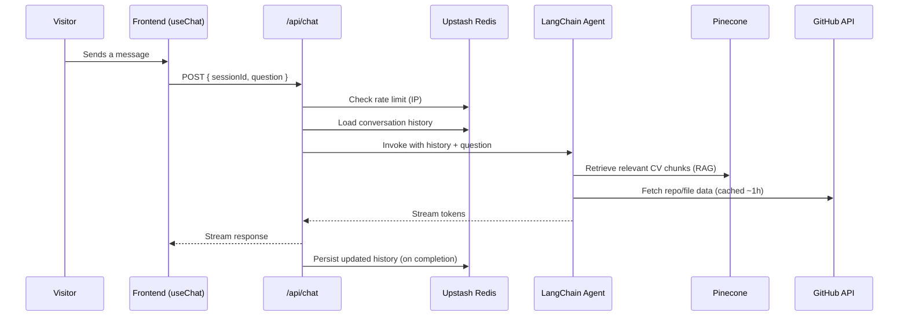

# Noureddine El Fatimi — Portfolio

[](https://nextjs.org/)
[](https://www.typescriptlang.org/)
[](https://noureddine-fatimi-github-io.vercel.app)

**Live demo:** [noureddine-fatimi-github-io.vercel.app](https://noureddine-fatimi-github-io.vercel.app)

Personal portfolio built with Next.js 16 and React 19, featuring an AI assistant that answers visitor questions about my background and projects — grounded in my actual CV and live GitHub data, not a static FAQ.

## ✨ Features

- **Portfolio showcase** — background, skills, and project highlights.
- **AI chat assistant** with streaming responses, aware of both my résumé and my GitHub repositories.
- **Conversation memory** that survives a page refresh (server-side session, not browser storage).
- **Rate-limited API** to keep the assistant available and cost-bounded under real traffic.
- **Tested** core logic (Vitest) and typed end-to-end (TypeScript, Zod).

## 🤖 How the chatbot works

The assistant is a LangChain agent (not a single prompt-and-response call) with two ways of grounding its answers:

- **RAG over my CV** — the résumé is embedded and indexed in Pinecone; relevant chunks are retrieved for questions about my background, experience, or skills.
- **Live GitHub tools** — a set of tools (list repos, inspect a repo's file tree, read specific files, analyze metadata) let the agent pull real, current information about my projects instead of relying on a stale summary.

Each request streams token-by-token to the browser, and the exchange is persisted so the conversation survives a refresh — without ever replaying raw tool output back into future turns (keeps context lean and avoids malformed history).



Two Upstash-backed rate limits protect the endpoint: a short burst window and a daily budget per IP, checked before any LLM or retrieval cost is incurred.

## 🛠️ Tech Stack

| Layer | Technology |
|---|---|
| Framework | Next.js 16, React 19, TypeScript |
| UI | Tailwind CSS 4, shadcn/ui, Base UI, Framer Motion |
| Agent | LangChain (`langchain`, `@langchain/core`, `@langchain/openai`) |
| Vector store | Pinecone (`@langchain/pinecone`) |
| CV ingestion | `pdf-parse`, `pdfjs-dist` |
| Chat streaming / UI | Vercel AI SDK (`ai`, `@ai-sdk/react`, `@ai-sdk/langchain`) |
| Memory & rate limiting | Upstash Redis, `@upstash/ratelimit` |
| Validation | Zod |
| Testing | Vitest |
| Hosting | Vercel |

## 📁 Project Structure

```
├── app/          # Next.js routes (pages + API routes, incl. /api/chat)
├── components/   # UI components
├── lib/          # Agent, RAG pipeline, GitHub tools, Redis helpers
├── scripts/      # Ingestion / maintenance scripts (e.g. CV → Pinecone)
├── tests/lib/    # Vitest test suite
├── doc/          # Project documentation
└── public/       # Static assets
```

## 🚀 Getting Started

```bash
git clone https://github.com/noureddineFatimi/noureddineFatimi.github.io.git
cd noureddineFatimi.github.io
pnpm install
cp .env.example .env.local   # fill in the values below
pnpm dev
```

## 🔑 Environment Variables

| Variable | Purpose |
|---|---|
| `LLM_MODEL` | Chat model name passed to the LangChain agent |
| `LLM_API_KEY` | API key for the model provider |
| `LLM_BASE_URL` | Provider base URL (OpenAI-compatible endpoint) |
| `UPSTASH_REDIS_REST_URL` | Upstash Redis REST endpoint |
| `UPSTASH_REDIS_REST_TOKEN` | Upstash Redis REST token |
| `SESSION_TTL` | Conversation history expiry, in seconds |
| Pinecone credentials | API key + index name for the CV vector store |
| GitHub token | Read-only token used by the GitHub tools |

> The last two rows use whatever variable names are set in `lib/` — check there if your local names differ.

## 🧪 Testing

```bash
pnpm test           # run once
pnpm test:watch     # watch mode
pnpm test:coverage  # with coverage report
```

## ☁️ Deployment

Deployed on [Vercel](https://vercel.com), which builds `app/` as serverless functions — required for the streaming `/api/chat` route, the LangChain agent, and Redis access.

## 📄 About

Built and maintained by **Noureddine El Fatimi**, Software Engineer (ENSA Kénitra), Casablanca, Morocco.

[Portfolio](https://noureddine-fatimi-github-io.vercel.app)
